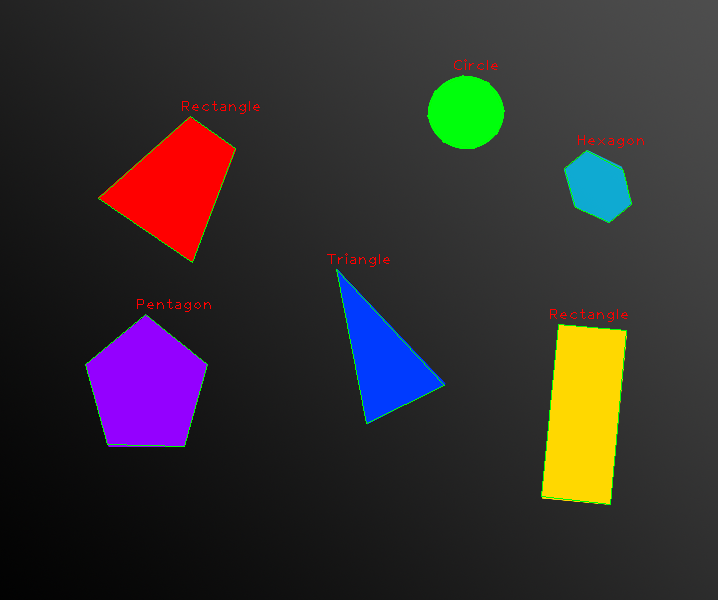

# 2D Shape Recognition
A simple shape recognition algorithm implemented using Python and opencv.

## How to run
1. Either fork or download the repository
2. Install opencv2 dependency using `npm i` command
3. Run the program

## How does it work
1. Reads image
2. Grayscale and blur the image and apply Canny edge detection
3. Find and grab contours
4. For each set of contours draw contour and apply convex hull to count number of edges
5. Displays shape name according to number of edges found

## Examples

Below you can find some example of recognition.

